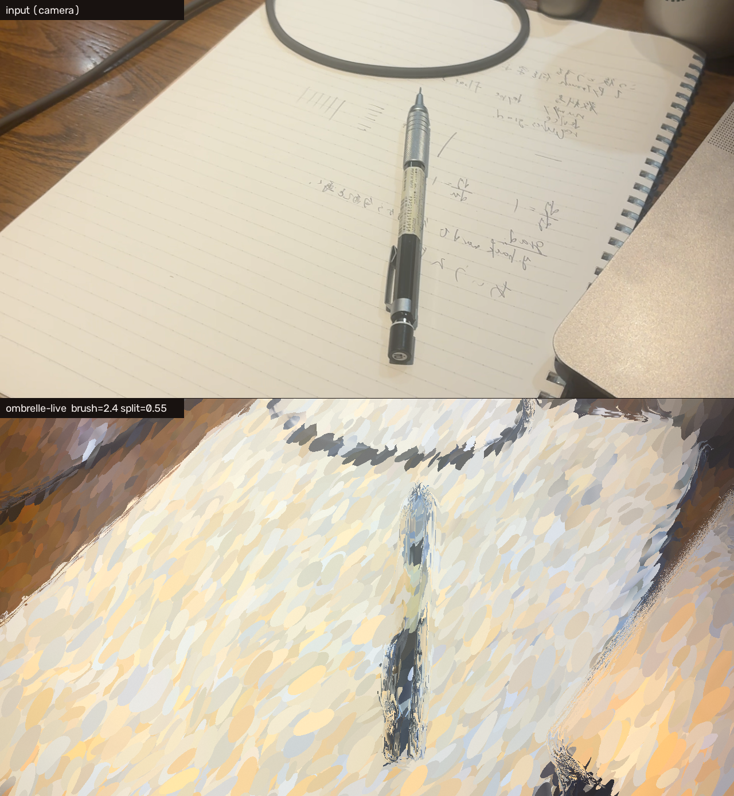
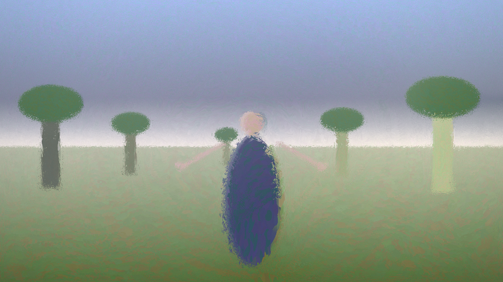
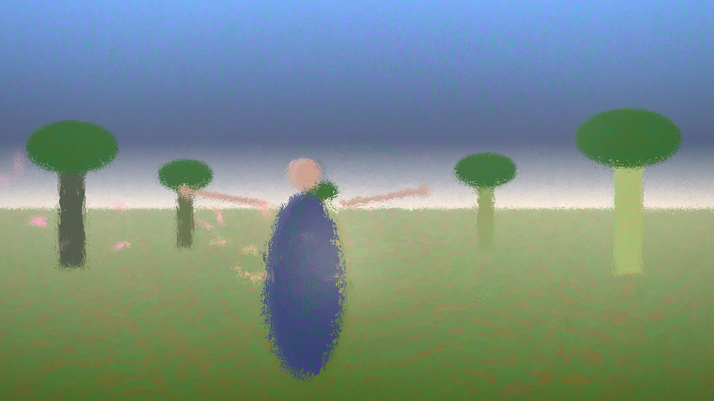
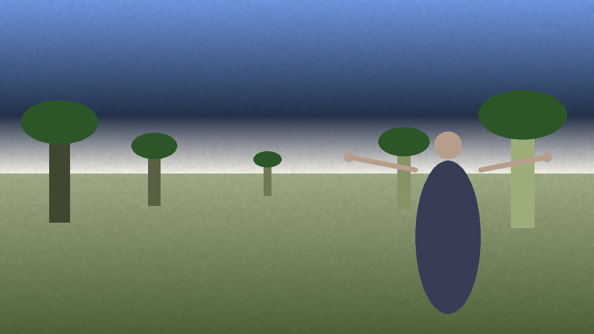
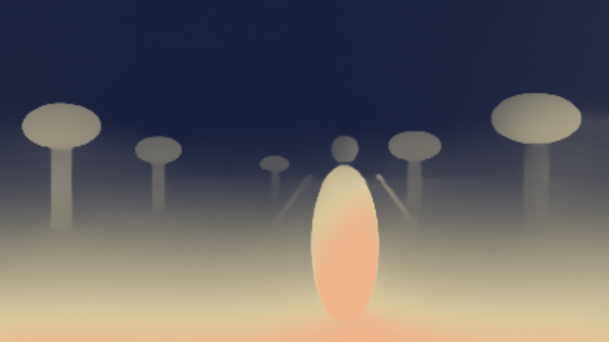
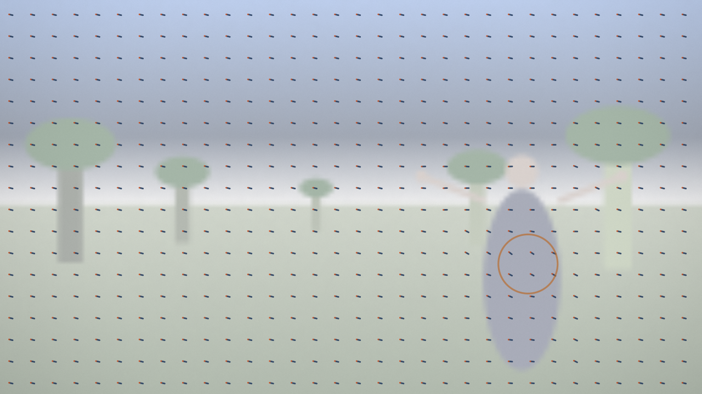
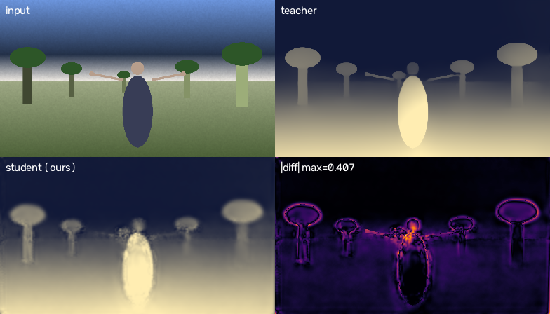

# ombrelle-live — 現実を印象派に変換するリアルタイム処理系

Web カメラの映像を、単眼深度推定とオプティカルフローで駆動して印象派絵画へ変換する。
**人が動くと筆触の向きが一斉に傾ぎ、止まると絵が凪ぐ。**

OpenCV (取り込み・フロー) → PyTorch/MPS (単眼深度・自作蒸留モデル) → OpenGL/GLSL (筆触レンダリング)

```bash
uv sync
uv run python -m ombrelle.app --source cam:0 --depth teacher
```

### 実写



> 意匠の追い込みは進行中。下の合成シーンの画像は、全段の動作検証と計測に使った
> 手続き生成のテスト台 (奥行きの手がかりと周期的な動きを意図的に入れてある)。

| 生成した絵 (合成入力・深度駆動) | 花びらのオクルージョン |
|---|---|
|  |  |

| 入力 | 深度 (teacher) | フローの場 |
|---|---|---|
|  |  |  |

---

## この作品の出発点

`reference/ombrelle_v11_3.frag` は、モネ《日傘をさす女(右向き)》1886 の翻案として書かれた
手続き型 GLSL 実装。丘・空・雲・風・花びらをすべて数式で生成し、その上に楕円の筆触を
乗せる。このシェーダには検証済みの法則がコメントとして残されている:

> 絵の層のパラメータ(筆サイズ/色相/彩度)は depth の関数にする。ただし目が理屈に勝つ。

つまり**この絵画表現は深度を入力として要求する構造になっている**。
だから手続き的な丘の `depth` を現実の深度推定に差し替えることは、機能追加ではなく
自然な一般化になる。同じ論法で `windF()` の解析的な風の場を人のオプティカルフローに
差し替えると、「人の行動に合わせる」がエフェクトの後付けではなく絵そのものの挙動になる。

| 原典の要素 | この実装での置き換え | 担当技術 |
|---|---|---|
| `renderScene(qc)` = 一筆の色 | `textureLod(uCam, qc, lod)` — 楕円の中心でカメラを1点サンプル | OpenCV → GL texture |
| `depth` (筆サイズ/彩度/色相族/空気遠近) | 単眼深度推定の出力 | PyTorch / MPS |
| `windF()` = 風の場 | 人の動きのオプティカルフロー | OpenCV Farneback |
| `SEAT` = 空席(不在の一点) | 動きのエネルギー重心 | — |
| 花びら | 動きから生まれ、深度でオクルージョンされる | GL + 深度比較 |

`reference/` の原典は無改変で置いてある。`ombrelle/gl/shaders/brush.frag` との diff が
そのまま「何を現実に差し替えたか」の記録になる。

---

## パイプライン

```
[取り込みスレッド]  OpenCV VideoCapture ─→ 最新フレーム1枚だけ保持 (キューに溜めない)
                                            │
[メインスレッド]  Farneback フロー (320x180, 空間ブラー + 時間EMA) ─→ RG16F テクスチャ
                                            │
[推論スレッド]    単眼深度 (teacher | 自作student) ─→ 非対称EMA正規化 ─→ R16F テクスチャ
                                            │   ※間に合わない入力は黙って捨てる
[メインスレッド]  moderngl: uCam / uDepth / uFlow
                  → brush.frag (楕円筆触 + 等輝度色彩分割 + 花びら + 深度オクルージョン)
                  → 内部解像度 FBO → ウィンドウへ提示
```

推論が描画より遅いことを**前提とした**設計。最新結果が無ければ前回の結果を使い続けるので、
深度が 26Hz でしか更新できなくても絵は 130fps で動く。詳細は [docs/architecture.md](docs/architecture.md)。

---

## 自作蒸留モデル

既製の Depth Anything V2 Small を教師にして疑似ラベルを自動生成し、
MobileNetV3-Small ベースの小型モデルを自分で学習させた。

```bash
uv run python -m train.collect  --source cam:0 --seconds 300 --out data/room
uv run python -m train.distill  --data data/room --epochs 30
uv run python -m train.eval     --data data/room --ckpt checkpoints/student.pt
```

### 単体のレイテンシ (teacher/student を交互に測ってGPUの熱ドリフトを相殺)

| モデル | パラメータ | median | p90 | std |
|---|---|---|---|---|
| teacher (Depth Anything V2 Small) | 24.79 M | 17.9 ms | 23.9 ms | 5.6 |
| **student (自作蒸留)** | **0.97 M** | **7.0 ms** | **7.8 ms** | **0.62** |

パラメータ **25.6x 削減**、レイテンシ **2.5x 短縮**。
平均値より**ばらつきが 9 分の 1 になった**方が実は重要で、リアルタイムループでは
p90 が体験を決める。

### アプリに載せた状態での A/B (合成入力・全エフェクト有効)

| | 描画 fps | end-to-end | 深度の実効更新 | 捨てた入力 |
|---|---|---|---|---|
| teacher | 52.9 | 36.3 ms | 26.2 Hz | 150 |
| **student** | **134.6** | **22.2 ms** | **31.7 Hz** | **30** |

単体比 (2.5x) が、その場でもほぼそのまま描画 fps の 2.5x として出た。
**GPU は描画と共有されているので、重いモデルは深度の更新を遅らせるだけでなく絵そのものを遅くする。**

### 精度 (教師を基準、正規化 [0,1])

| MAE | 誤差<0.05 の画素率 | 誤差<0.10 | AbsRel (gt>0.05) | RMSE |
|---|---|---|---|---|
| 0.0171 | 93.5 % | 97.9 % | 0.0793 | 0.0330 |



**誤差は物体の輪郭に集中する** (右下の差分図)。筆サイズや彩度のような低周波の駆動には
十分だが、オクルージョンの境界はまさにその高周波にある。student の出力解像度が
teacher の半分であることも効いている。次の一手はここ。

> この精度は合成シーン (背景1種) で採ったものなので、汎化性能の主張には使えない。
> コード経路と手法の検証に留まる。実写での再学習が次のステップ。

---

## 予想が外れた4つのこと

**1. パラメータを 25.6 分の1 にする前に、前処理を測るべきだった**

student の forward は 6.4 ms。ところが `cv2.resize` の `INTER_AREA` による
1280x720 → 392x224 の縮小だけで **6.86 ms** かかっていた。**前処理が推論より重い。**
GPU 側の antialias 付き bilinear に移して **1.27 ms** (cv2 の `INTER_LINEAR` も
1.11 ms だがエイリアスが出るので採らない)。

モデルを軽くしても固定費が残っていれば体感は変わらない。「軽量化」を語る前に
「モデル以外」を測る順序が必要だった。

**2. フリッカ対策の EMA 正規化が、静止シーンでは逆に悪化した**

単眼深度は相対逆深度なので、毎フレーム素の min-max 正規化をすると近い物が
出入りするだけでレンジが跳ね、筆サイズと彩度が一斉に変わって絵全体が呼吸する。
対策として min/max を非対称 EMA (広がる方向は速く、縮む方向は遅く) で追従させた。

ところが深度レンジがほぼ変わらない合成シーンでは、時間的一貫性が
**0.0072 → 0.0083 と悪化した**。EMA の追従ラグ自体が変化を生むため。
人が出入りしてレンジが跳ねる実写でないと効果を測れない。**実写待ちの宿題。**

**3. 精度で劣る student の方が、深度が時間的に落ち着いていた**

| モデル | 連続フレーム間の平均絶対差 |
|---|---|
| teacher | 0.0072 |
| student | 0.0045 |

小さいモデルは滑らかな関数なので、入力の微小変化に反応しにくい。
この作品にとって深度は「絵のパラメータ」なので、1枚の精度よりフレーム間の落ち着きが
体験を支配する。**数値の良し悪しと絵の破綻は一致しない。**

**4. 原典の「赤方向には決して届かない」は、変換の性質ではなく入力の性質だった**

実写を初めて通したら肌がマゼンタに転んだ。原典の色彩分割は色相を固定角で回していて、
対象が緑だったから「赤に届かない」が成立していただけだった。

| 対象 | 元の色相 | 三族回転の行き先 |
|---|---|---|
| 草 (原典の対象) | 103.6° | 72.6° / 103.6° / 113.0° |
| **肌 (実写)** | 20.0° | **344.8°** / 20.0° / 28.4° |

色相回転をやめ、「光は暖色・影は寒色」という色温度の軸にずらす方式へ変更
(元の色相に依存しない)。最大ずれは 35.2° → 5.3° になった。

数式を移植するときは、その数式が暗黙に仮定している入力の範囲まで持ってくる必要がある。
2 番目の霞の件とまったく同じ種類の間違いを、別の場所でもう一度やっていた。

---

## 操作

```bash
uv run python -m ombrelle.app --source cam:0 --depth teacher
uv run python -m ombrelle.app --source synthetic --depth student   # カメラ無しで検証
uv run python -m ombrelle.app --source path/to/video.mp4 --depth teacher
```

| キー | |
|---|---|
| `0` `1` `2` `3` | 筆触 / 生カメラ / 深度 / フローの場 |
| `d` | teacher ↔ student ↔ off を切り替え (同じ画面で比較できる) |
| `k` `l` | 空気遠近の霞を弱く / 強く |
| `n` `m` | 彩度を下げる / 上げる |
| `[` `]` | 風の利得 |
| `v` `b` | **筆の大きさ** (絵に見えるかを最も強く決める) |
| `t` `y` | 色彩分割の強さ (暖色側/寒色側への振り分け) |
| `,` `.` | 筆のぼかし (カメラの mip レベル) |
| `-` `=` | 絵の強さ (0 でグレーディングのみ、1 で完全に絵) |
| `s` | スクリーンショット (設定の .json と生カメラの _raw.png も一緒に保存) |
| `p` | いまの意匠パラメータを `config.json` に保存 (次回起動時に自動で読まれる) |
| `h` | HUD |
| `q` / `Esc` | 終了 |

絵は目で決めるものなので、意匠のパラメータは全部実行中に動かせるようにしてある。
決めた値は `p` で `config.json` に残り、次回から既定値になる
(コマンドライン引数を明示すればそちらが優先)。

---

## 環境

Apple M4 Pro / macOS 26.3 / Python 3.12 / PyTorch 2.13 (MPS) / OpenCV 5.0 / moderngl 5.12

macOS の OpenGL は 4.1 で打ち止めかつ deprecated なので **compute shader が使えない**。
パーティクルは現在フラグメントシェーダ内のループで処理している (24枚)。
本数を増やすなら transform feedback への移行が次の手。

## 今後

- 実写での再収集・再学習と、意匠パラメータの追い込み
- 誤差が集中する輪郭の改善 (勾配損失の重み、出力解像度、エッジ考慮の refine)
- 花びらを transform feedback に移して本数を数万に
- CoreML / ONNX Runtime へのエクスポートと int8 量子化
- 人物セグメンテーションでオクルージョン境界を精緻化
